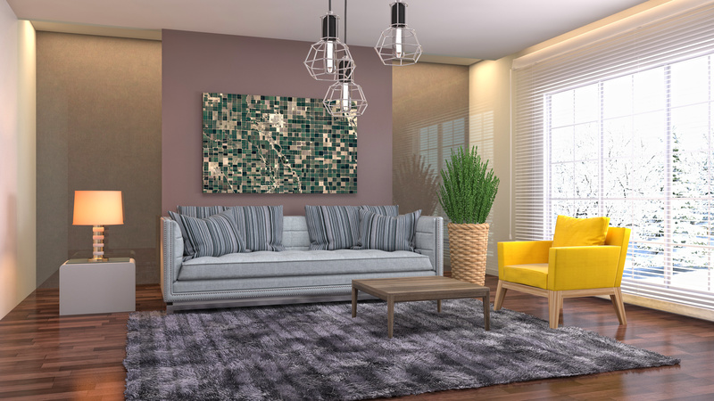
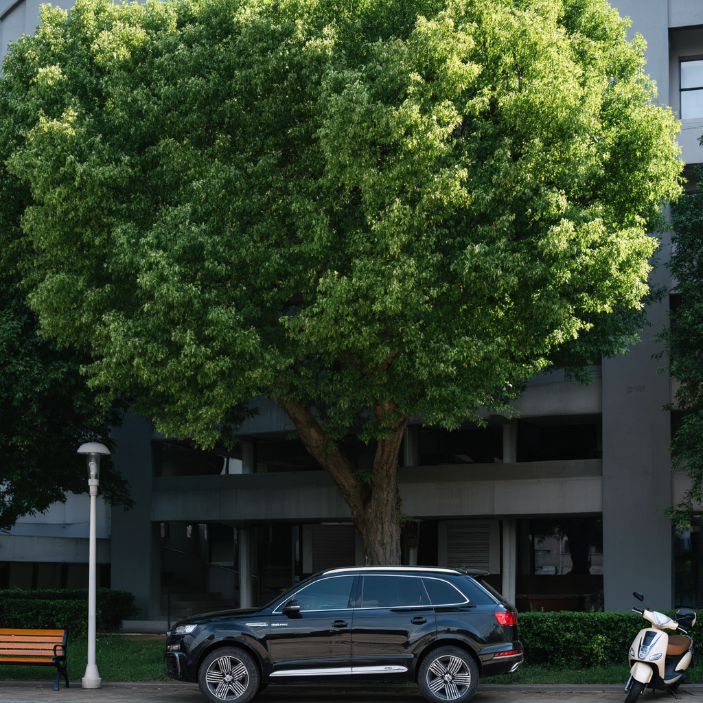
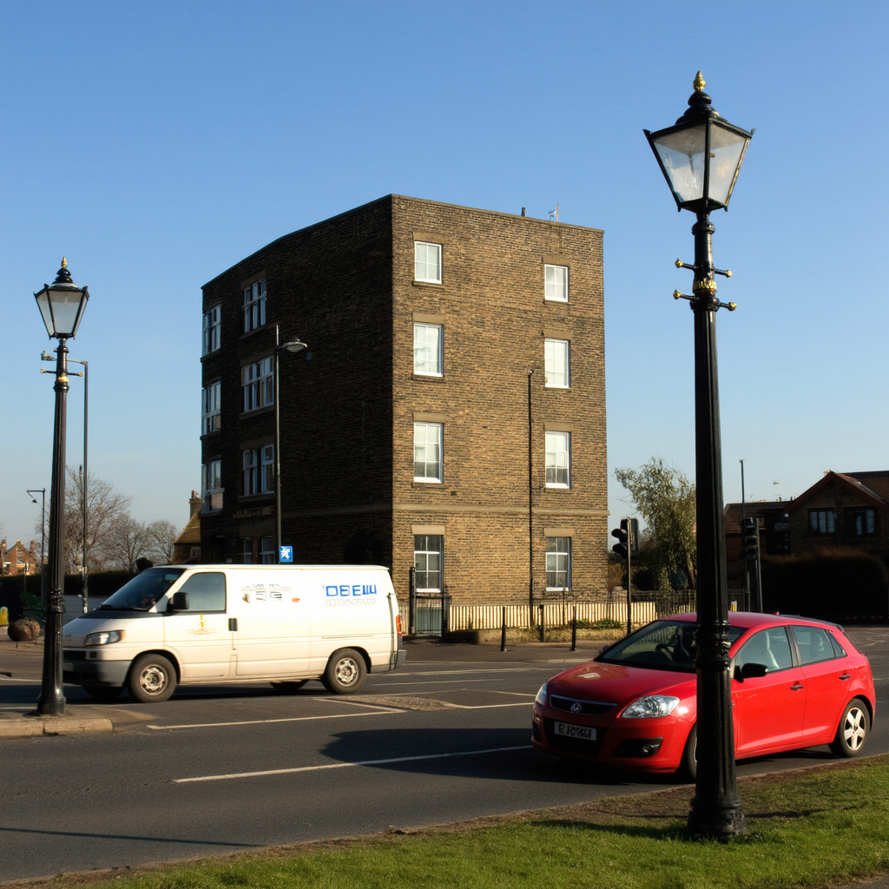
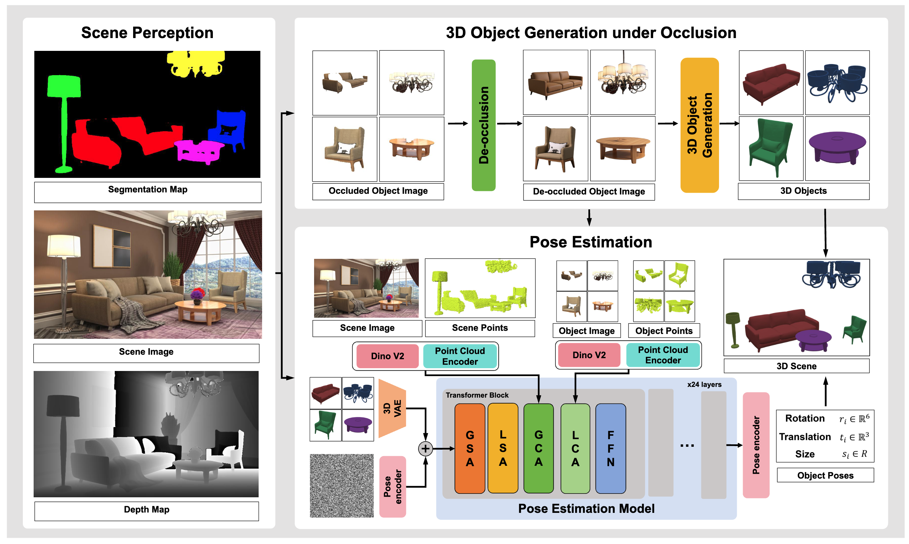

# SceneMaker: Open-set 3D Scene Generation with Decoupled De-occlusion and Pose Estimation Model

<!-- <div align="center">


</div> -->

**Yukai Shi<sup>1,3</sup>**, **Weiyu Li<sup>2,4</sup>**, **Zihao Wang<sup>4</sup>**, **Hongyang Li<sup>3</sup>**, **Xingyu Chen<sup>3</sup>**, **Ping Tan<sup>2,4</sup>**, **Lei Zhang<sup>3</sup>**

<sup>1</sup> Tsinghua University &nbsp;&nbsp;
<sup>2</sup> HKUST &nbsp;&nbsp;
<sup>3</sup> IDEA Research &nbsp;&nbsp;
<sup>4</sup> LightIllusions

<div align="center">

[](https://github.com/IDEA-Research/SceneMaker)
[](https://github.com/IDEA-Research/SceneMaker)
[](https://github.com/IDEA-Research/SceneMaker)

</div>

<table>
<tr>
<td align="center">
<table>
<tr><th>Scene Image</th><th>Normal Map</th><th>3D Scene</th></tr>
<tr>
<td></td>
<td></td>
<td></td>
</tr>
</table>
</td>
<td align="center">
<table>
<tr><th>Scene Image</th><th>Normal Map</th><th>3D Scene</th></tr>
<tr>
<td></td>
<td></td>
<td></td>
</tr>
</table>
</td>
</tr>
<tr>
<td align="center">
<table>
<tr><th>Scene Image</th><th>Normal Map</th><th>3D Scene</th></tr>
<tr>
<td></td>
<td></td>
<td></td>
</tr>
</table>
</td>
<td align="center">
<table>
<tr><th>Scene Image</th><th>Normal Map</th><th>3D Scene</th></tr>
<tr>
<td></td>
<td></td>
<td></td>
</tr>
</table>
</td>
</tr>
<tr>
<td align="center">
<table>
<tr><th>Scene Image</th><th>Normal Map</th><th>3D Scene</th></tr>
<tr>
<td></td>
<td></td>
<td></td>
</tr>
</table>
</td>
<td align="center">
<table>
<tr><th>Scene Image</th><th>Normal Map</th><th>3D Scene</th></tr>
<tr>
<td></td>
<td></td>
<td></td>
</tr>
</table>
</td>
</tr>
</table>

## Abstract

We propose a decoupled 3D scene generation framework called **SceneMaker** in this work. Due to the lack of sufficient open-set de-occlusion and pose estimation priors, existing methods struggle to simultaneously produce high-quality geometry and accurate poses under severe occlusion and open-set settings. To address these issues, we first decouple the de-occlusion model from 3D object generation, and enhance it by leveraging image datasets and collected de-occlusion datasets for much more diverse open-set occlusion patterns. Then, we propose a unified pose estimation model that integrates global and local mechanisms for both self-attention and cross-attention to improve accuracy. Besides, we construct an open-set 3D scene dataset to further extend the generalization of the pose estimation model. Comprehensive experiments demonstrate the superiority of our decoupled framework on both indoor and open-set scenes. Our codes and datasets will be released.


## Framework

Our framework consists of three main components:
1. **Scene Perception**: Understanding the input scene structure
2. **3D Object Generation under Occlusion**: Decoupled de-occlusion model for robust object generation
3. **Pose Estimation**: Unified pose estimation model with global and local attention mechanisms

We decouple the de-occlusion model from 3D object generation. We construct a unified pose estimation model that incorporates both global and local attention mechanisms.



## Open Source Progress

- ✅ **Dataset**: Released
- ⏳ **Inference Code**: Coming soon
- ⏳ **Training Code**: Coming soon


## Citation

If you find our work useful in your research, please consider citing:

```bibtex
@article{
}
```
