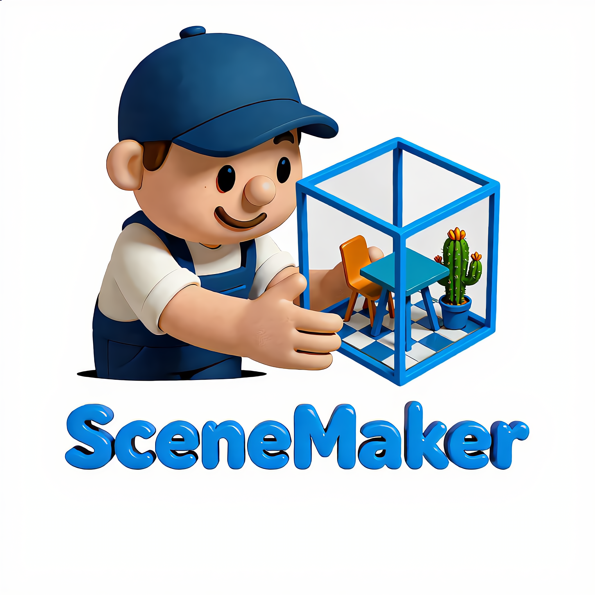
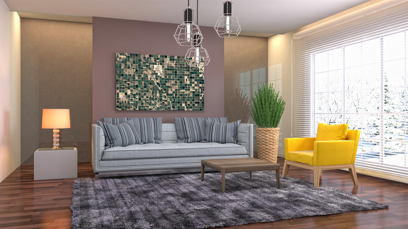
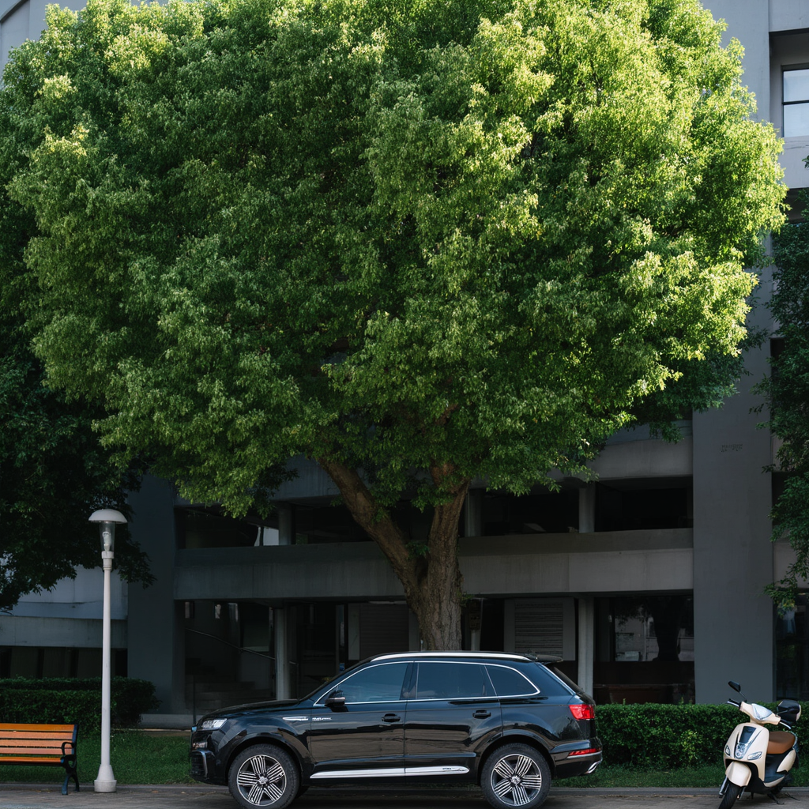
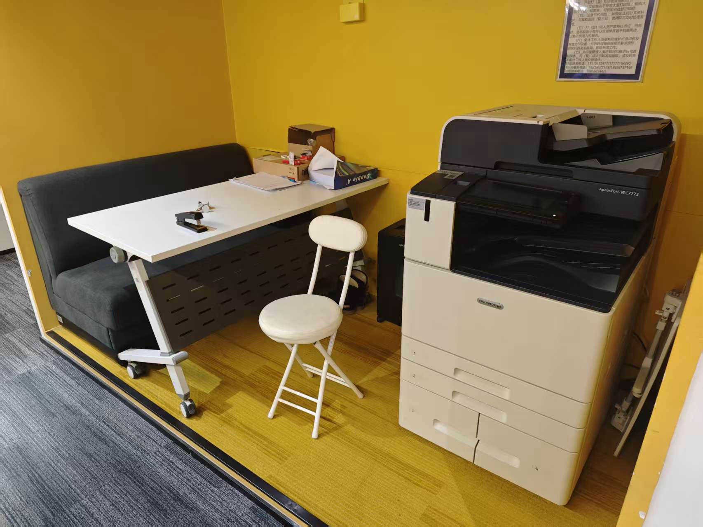
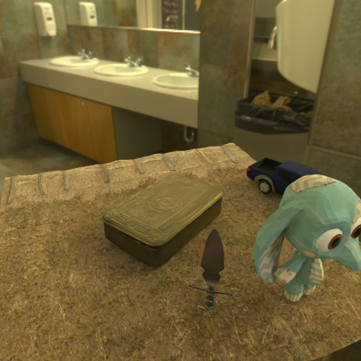
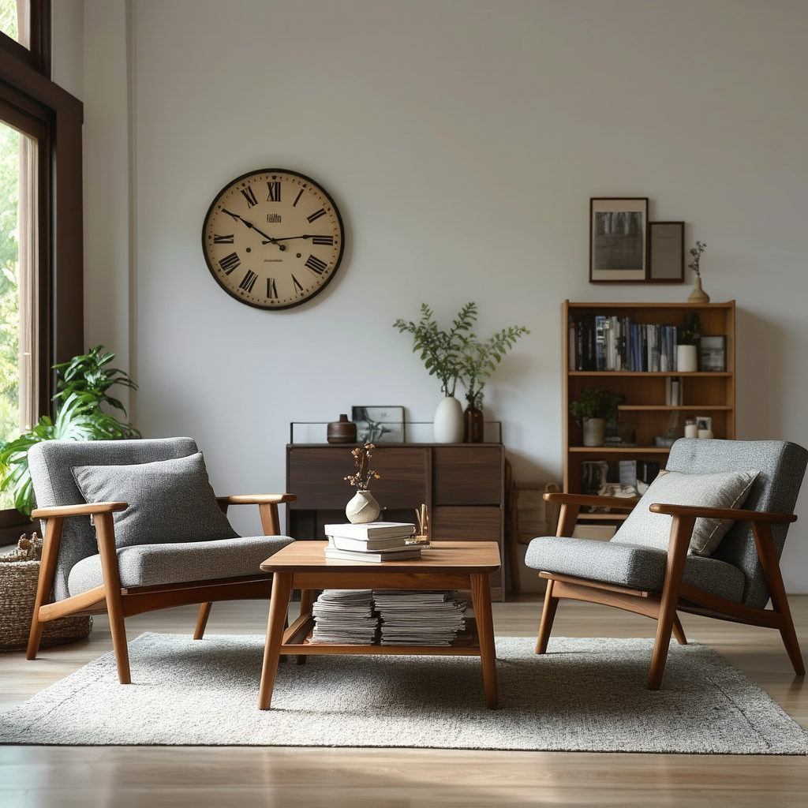
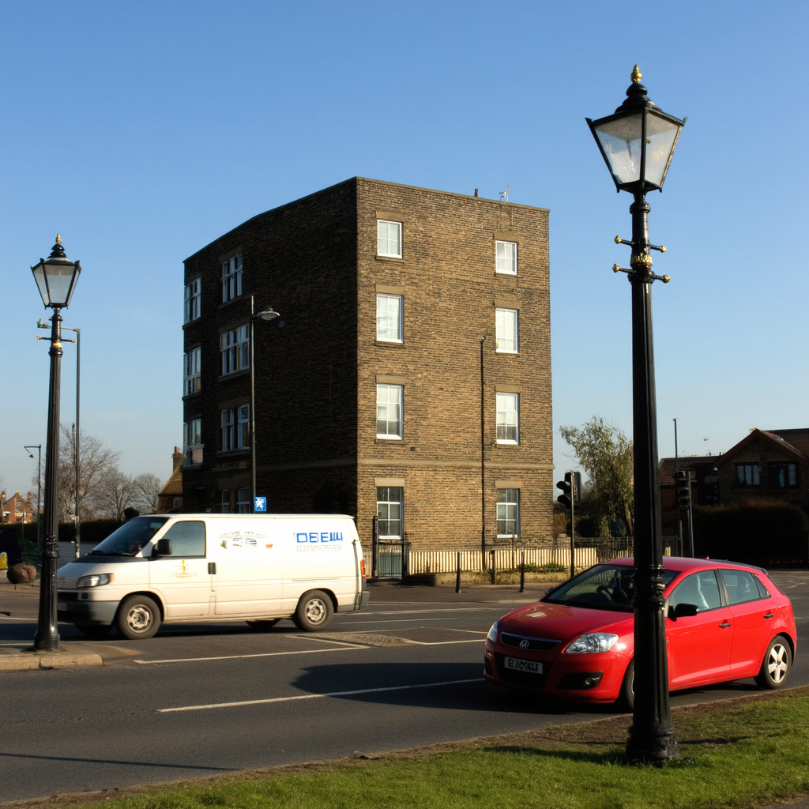
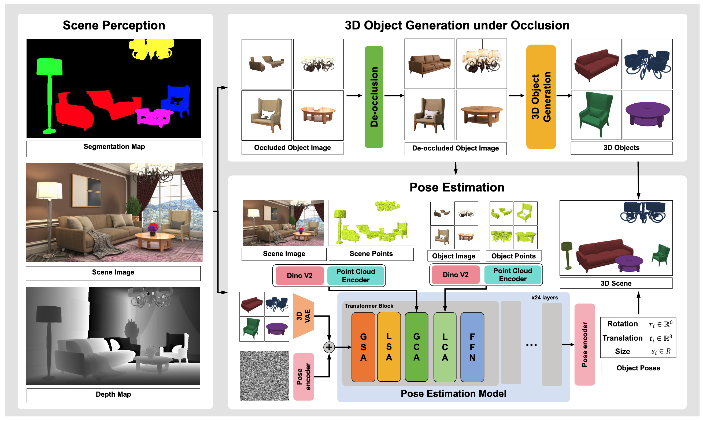

# SceneMaker: Open-set 3D Scene Generation with Decoupled De-occlusion and Pose Estimation Model

<!-- <div align="center">



</div> -->

**Yukai Shi<sup>1,3</sup>**, **Weiyu Li<sup>2,4</sup>**, **Zihao Wang<sup>4</sup>**, **Hongyang Li<sup>3</sup>**, **Xingyu Chen<sup>3</sup>**, **Ping Tan<sup>2,4</sup>**, **Lei Zhang<sup>3</sup>**

<sup>1</sup> Tsinghua University &nbsp;&nbsp;
<sup>2</sup> HKUST &nbsp;&nbsp;
<sup>3</sup> IDEA Research &nbsp;&nbsp;
<sup>4</sup> LightIllusions

<div align="center">


[](https://arxiv.org/abs/2512.10957)
[](https://idea-research.github.io/SceneMaker/)
[](https://huggingface.co/datasets/LightillusionsLab/SceneMaker)
[](https://github.com/IDEA-Research/SceneMaker)

</div>

<table>
<tr>
<td align="center">
<table>
<tr><th>Scene Image</th><th>Normal Map</th><th>3D Scene</th></tr>
<tr>
<td></td>
<td></td>
<td></td>
</tr>
</table>
</td>
<td align="center">
<table>
<tr><th>Scene Image</th><th>Normal Map</th><th>3D Scene</th></tr>
<tr>
<td></td>
<td></td>
<td></td>
</tr>
</table>
</td>
</tr>
<tr>
<td align="center">
<table>
<tr><th>Scene Image</th><th>Normal Map</th><th>3D Scene</th></tr>
<tr>
<td></td>
<td></td>
<td></td>
</tr>
</table>
</td>
<td align="center">
<table>
<tr><th>Scene Image</th><th>Normal Map</th><th>3D Scene</th></tr>
<tr>
<td></td>
<td></td>
<td></td>
</tr>
</table>
</td>
</tr>
<tr>
<td align="center">
<table>
<tr><th>Scene Image</th><th>Normal Map</th><th>3D Scene</th></tr>
<tr>
<td></td>
<td></td>
<td></td>
</tr>
</table>
</td>
<td align="center">
<table>
<tr><th>Scene Image</th><th>Normal Map</th><th>3D Scene</th></tr>
<tr>
<td></td>
<td></td>
<td></td>
</tr>
</table>
</td>
</tr>
</table>

## Abstract

We propose a decoupled 3D scene generation framework called **SceneMaker** in this work. Due to the lack of sufficient open-set de-occlusion and pose estimation priors, existing methods struggle to simultaneously produce high-quality geometry and accurate poses under severe occlusion and open-set settings. To address these issues, we first decouple the de-occlusion model from 3D object generation, and enhance it by leveraging image datasets and collected de-occlusion datasets for much more diverse open-set occlusion patterns. Then, we propose a unified pose estimation model that integrates global and local mechanisms for both self-attention and cross-attention to improve accuracy. Besides, we construct an open-set 3D scene dataset to further extend the generalization of the pose estimation model. Comprehensive experiments demonstrate the superiority of our decoupled framework on both indoor and open-set scenes. Our codes and datasets will be released.


## Framework

Our framework consists of three main components:
1. **Scene Perception**: Understanding the input scene structure
2. **3D Object Generation under Occlusion**: Decoupled de-occlusion model for robust object generation
3. **Pose Estimation**: Unified pose estimation model with global and local attention mechanisms

We decouple the de-occlusion model from 3D object generation. We construct a unified pose estimation model that incorporates both global and local attention mechanisms.



## 🚀 Open Source Progress

- ✅ **Dataset**: Available
- ✅ **Inference Code**: Released
- ✅ **Training Code**: Released

> **Note**
> The open-source release uses **FLUX Kontext** as the de-occlusion model and **Step1X-3D** as the 3D generation model.
> This is a bit different from the exact implementation described in the paper.

## 🛠️ Installation

1. Install Python dependencies for python 3.10:

```bash
pip install -r requirements.txt
```

2. Install MoGe for depth estimation:

- MoGe repo: https://github.com/microsoft/MoGe
- Please follow the official MoGe repository instructions for installation.

3. Install Step1x-3D for 3D obejct generation:
```bash
git clone --depth 1 --branch main https://github.com/stepfun-ai/Step1X-3D.git
```

4. Download checkpoints from Hugging Face, and place in the corresponding folders ( `ckpts/` ):

- SceneMaker checkpoints: https://huggingface.co/horizon171852/SceneMakerSceneMaker

## 🎬 Demo (Segmentation + De-occlusion + 3D object generation + Pose estimation)

```bash
bash run_gradio.sh
```

## 🎯 Single Pose Estimation

Select corresponding checkpoints (indoor / open-set), and run scripts:

```bash
bash run_generation.sh
```

## 🏋️ Training

Download required datasets:

- InstPIFu: https://github.com/GAP-LAB-CUHK-SZ/InstPIFu
- MIDI-3D: https://github.com/VAST-AI-Research/MIDI-3D
- SceneMaker OpenSet Dataset: https://huggingface.co/datasets/LightillusionsLab/

Select config in `configs/image-to-scene-diffusion` and Run scripts:

```bash
bash run_train.sh
```


## Citation

If you find our work useful in your research, please consider citing:

```bibtex
@article{shi2025scenemaker,
  title={SceneMaker: Open-set 3D Scene Generation with Decoupled De-occlusion and Pose Estimation Model},
  author={Shi, Yukai and Li, Weiyu and Wang, Zihao and Li, Hongyang and Chen, Xingyu and Tan, Ping and Zhang, Lei},
  journal={arXiv preprint arXiv:2512.10957},
  year={2025}
}
```

## Acknowledgement

We would like to thank the authors of the following projects for their excellent work and open-source contributions:

- [MoGe](https://github.com/microsoft/MoGe) - Monocular depth estimation
- [SAM](https://github.com/facebookresearch/segment-anything) - Segment Anything Model for image segmentation
- [DINO-X](https://cloud.deepdataspace.com/zh/playground/dino-x) - Grounding segementation
- [CraftsMan](https://github.com/wyysf-98/CraftsMan) - 3D object generation
- [Step1x-3D](https://github.com/stepfun-ai/Step1X-3D) - 3D object generation
- [Hunyuan3D](https://github.com/tencent-hunyuan/hunyuan3d-2.1) - 3D object generation
- [MIDI3D](https://github.com/VAST-AI-Research/MIDI-3D) - Multi-instance 3D scene generation
- [InstPIFu](https://github.com/GAP-LAB-CUHK-SZ/InstPIFu) - Indoor 3D scene generation

Their contributions have been invaluable to the development of SceneMaker.

## License

See [LICENSE](LICENSE) file for details.
